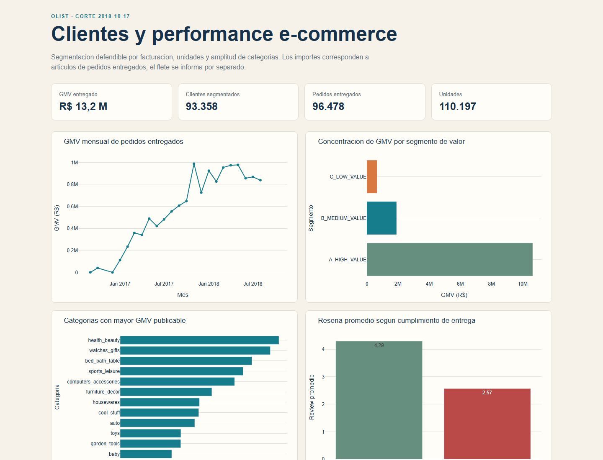

# Analytics de clientes e-commerce

[](LICENSE)
[](https://github.com/alexanderhuth98/analytics-clientes-ecommerce/actions/workflows/ci.yml)
[](https://github.com/alexanderhuth98/analytics-clientes-ecommerce/actions/workflows/pages.yml)

Caso de Data Analytics sobre el **Brazilian E-Commerce Public Dataset by Olist**.
Construye una vista reproducible de clientes, valor, volumen, amplitud de compra y
experiencia de entrega, con DuckDB, SQL y artefactos agregados aptos para portfolio.

El [dashboard publico](https://alexanderhuth98.github.io/analytics-clientes-ecommerce/)
se despliega desde `site/` mediante GitHub Pages; la captura inferior documenta el build
de referencia.



## Impacto en 60 segundos

| Resultado | Hallazgo |
|---|---|
| Escala | `93.358` clientes elegibles generaron `R$ 13.221.498,11` de GMV de articulos entregados. |
| Concentracion | El segmento A reune `42.747` clientes y `80,6%` del GMV elegible. |
| Comportamiento | `81.748` clientes compraron una unidad; `89.918` observaron una sola categoria conocida. |
| Mix | `health_beauty` lidera las categorias publicables con `R$ 1.233.131,72` de GMV. |
| Experiencia | La review ponderada fue `4,29` en entregas a tiempo y `2,57` en entregas tardias. |
| Calidad | El build publicado supero los `11` controles `HIGH`; quedaron `4` advertencias `MEDIUM`. |

**Build de referencia:** `4877d616-bad1-48d6-bffb-17005001d164`  
**Corte analitico:** `2018-10-17`

## Preguntas de negocio

1. Cuanto valor de mercaderia entregada concentra cada grupo de clientes?
2. Como se diferencian valor, cantidad de unidades y amplitud de categorias?
3. Que categorias concentran mayor GMV con cobertura suficiente?
4. Como cambia la review observada entre entregas a tiempo y tardias?
5. Que vendedores y cruces pueden compararse sin exponer grupos pequenos?
6. Que limitaciones de fuente deben permanecer visibles antes de publicar?

## Solucion

- Descarga un snapshot de nueve CSV y registra URL, tamano, SHA-256 y fecha.
- Valida contratos de columnas y carga `1.550.922` filas fuente en DuckDB.
- Distingue la identidad de pedido `customer_id` de la identidad analitica
  `customer_unique_id`.
- Agrega items, pagos y reviews por pedido antes de unirlos para evitar fanout.
- Segmenta clientes por valor ABC, unidades y cantidad de categorias conocidas.
- Suprime comparaciones con menos de 30 clientes o pedidos, segun el mart, y excluye la
  fila completa de los artefactos publicos.
- Ejecuta 15 controles de integridad y conserva advertencias no bloqueantes.
- Exporta ocho CSV agregados, Parquet, Excel, informes y dashboard HTML.
- Alimenta Power BI solo con datos agregados; no publica filas de clientes o pedidos.

## Metodologia

### Poblacion y GMV

La segmentacion incluye pedidos `delivered` hasta el corte, items con valor no negativo y
clientes con `customer_unique_id`. El GMV es la suma de `price` de los items entregados;
excluye flete, pagos, costos, devoluciones economicas no observadas y margen.

### ABC de valor

Los clientes se ordenan por GMV descendente. Los empates de GMV se mantienen juntos y se
clasifican usando la participacion acumulada anterior al empate:

- A: acumulado anterior menor a `80%`.
- B: acumulado anterior desde `80%` y menor a `95%`.
- C: acumulado anterior desde `95%`.

Por los empates, A alcanza `80,55%`, no exactamente `80%`. ABC describe concentracion
historica de GMV; no es un score de propension, rentabilidad o fidelidad.

### Volumen y amplitud

- Unidades: `1`, `2-3` y `4+`.
- Categorias conocidas: `1` especialista, `2` mixto y `3+` diversificado.
- Si no existe categoria conocida, el cliente queda como `UNKNOWN`; no se imputa.

La definicion completa y los gates de cobertura estan en
[metodologia](docs/methodology.md).

## Identidad y fanout

En Olist, `customer_id` identifica la referencia usada por un pedido y su direccion; en
este snapshot hay `99.441` valores para `99.441` pedidos. `customer_unique_id` aproxima a
la persona compradora entre pedidos y tiene `96.096` valores distintos. La segmentacion
usa exclusivamente este ultimo.

Items, pagos y reviews son relaciones uno a muchos: se observaron `9.803` pedidos con mas
de un item, `2.961` con mas de una fila de pago y `547` con mas de una review. Unir esas
tablas sin agregarlas multiplicaria importes y conteos. `mart_order_summary` agrega cada
hecho a un pedido antes de combinarlos.

## Calidad del build

| Advertencia `MEDIUM` | Observado | Tratamiento |
|---|---:|---|
| Cronologias fuente invalidas | 23 | Se excluyen de metricas operativas; no se reescriben. |
| Diferencia pago vs. item mas flete mayor a R$ 1 | 256 | Se informa; no se imputa ni se usa para redefinir GMV. |
| Pedidos entregados sin review | 646 | Permanecen sin review y no entran en su promedio. |
| Productos sin categoria utilizable | 623 | Se conservan como `unknown`. |

El build tiene `0` fallas `HIGH`. Esto significa que supera los controles bloqueantes
definidos, no que la fuente sea perfecta ni que todas las advertencias esten resueltas.

## Stack

`Python 3.11-3.12` | `DuckDB` | `SQL` | `pandas` | `Parquet` | `Plotly` | `Excel` | `Power BI`

## Arquitectura

```text
Kaggle/Olist -> ZIP + SHA-256 -> CSV raw -> ingest transaccional -> DuckDB
    -> dimensiones y hechos -> marts por grano -> 15 quality checks
    -> CSV/Parquet/Excel/reportes -> dashboard HTML y Power BI
```

- La descarga usa archivo parcial y extraccion en staging.
- La ingesta publica una nueva base solo despues de validar los nueve contratos.
- El build de tablas y controles ocurre dentro de una transaccion DuckDB.
- Los CSV publicos son agregados; raw, warehouse, Parquet y binarios se ignoran en Git.
- `outputs/` conserva localmente los marts completos para control. `portfolio_data/` y
  `site/` reciben una vista publica separada que admite exclusivamente filas
  `coverage_status = PUBLISHABLE`; cualquier otro estado se excluye con identificadores
  y metricas, sin reemplazar valores por cero.

Consulte [arquitectura](docs/architecture.md) para granos y flujo completo.

## Explorar el proyecto

| Recurso | Contenido |
|---|---|
| [Indice de documentacion](docs/README.md) | Mapa de lectura tecnico y analitico. |
| [EDA](docs/eda.md) | Hallazgos, cobertura y limitaciones del corte. |
| [Metodologia](docs/methodology.md) | Poblacion, ABC, thresholds y reglas de publicacion. |
| [Diccionario](docs/data_dictionary.md) | Granos y campos de los ocho CSV publicos. |
| [Limpieza](docs/cleaning_log.md) | Transformaciones y excepciones preservadas. |
| [SQL highlights](docs/sql_highlights.md) | Consultas centrales comentadas. |
| [Acceso a datos](docs/data_access.md) | Fuente, credenciales, hash, licencia y privacidad. |
| [Operaciones](docs/operations.md) | Ejecucion, validacion, CI y recuperacion. |
| [Releases](docs/releases.md) | Checklist de empaquetado y publicacion. |
| [Datos agregados](portfolio_data/) | Ocho CSV anonimizados para revision y Power BI. |
| [Dashboard web](site/index.html) | Resultado ejecutivo HTML listo para GitHub Pages. |
| [Proyecto Power BI](powerbi/AnalyticsClientes.pbip) | PBIP editable; el PBIX se publica como activo de GitHub Release. |
| [Informe ejecutivo](reports/2018-10-17/resumen_ejecutivo.md) | Sintesis del build de referencia. |
| [Validacion](reports/2018-10-17/validation_report.md) | Resultado de los 15 controles. |

## Ejecutar

La instalacion recomendada usa el lockfile versionado:

```powershell
uv sync --extra dev --locked
uv run ecommerce-clientes --help
```

Pipeline completo:

```powershell
uv run ecommerce-clientes all --as-of 2018-10-17
```

Ejecucion por etapas:

```powershell
uv run ecommerce-clientes download
uv run ecommerce-clientes ingest
uv run ecommerce-clientes build --as-of 2018-10-17
uv run ecommerce-clientes validate
uv run ecommerce-clientes export
```

La descarga puede usar `KAGGLE_USERNAME` y `KAGGLE_KEY`; nunca deben versionarse.
Consulte [acceso a datos](docs/data_access.md) antes de redistribuir la fuente.

## CI y publicacion

- El repositorio publico canonico es
  [GitHub](https://github.com/alexanderhuth98/analytics-clientes-ecommerce). GitLab se usa
  solo como origen privado de desarrollo y no se presenta como URL publica del paquete.
- `ci.yml` sincroniza con `uv`, ejecuta `ruff`, `pytest` con cobertura, audita
  dependencias y busca secretos.
- `pages.yml` publica el contenido ya generado de `site/`; no reconstruye datos ni
  descarga la fuente.
- Dependabot revisa dependencias de GitHub Actions y del ecosistema Python.
- La suite contiene `50` pruebas aisladas de internet y del warehouse local.
- La verificacion final alcanzo `93,5%` de cobertura total; CI bloquea valores inferiores
  al `80%`.

## Limitaciones

- El dataset es historico, anonimizado y describe la red Olist observada entre 2016 y 2018.
- Una identidad anonima no equivale necesariamente a una persona o un hogar real.
- GMV no es ingreso reconocido, margen, beneficio ni valor de vida del cliente.
- La baja recurrencia observada no permite presentar ABC como segmentacion de fidelidad.
- Las reviews faltantes pueden introducir sesgo de seleccion.
- La relacion entre demora y review es descriptiva, no causal.
- Los grupos bajo el threshold de 30 se suprimen; sus filas completas no se publican y
  sus valores no se reemplazan por cero.

## Fuente y licencias

- Fuente: [Brazilian E-Commerce Public Dataset by Olist](https://www.kaggle.com/datasets/olistbr/brazilian-ecommerce), publicado en Kaggle por Olist.
- Evidencia de procedencia: `manifests/raw_sources.jsonl` conserva URL de descarga,
  SHA-256 y lista de archivos del snapshot usado.
- La [metadata de Kaggle](https://www.kaggle.com/api/v1/datasets/view/olistbr/brazilian-ecommerce), consultada nuevamente el `2026-08-27`, expone `CC BY-NC-SA 4.0` en
  `licenseName`. Esa declaracion corresponde a la plataforma/fuente y debe volver a
  verificarse antes de redistribuir datos, porque la metadata externa puede cambiar.
- Licencia del codigo y la documentacion de este proyecto: [MIT](LICENSE). MIT no
  relicencia los datos de Olist ni reemplaza las condiciones declaradas por Kaggle.
